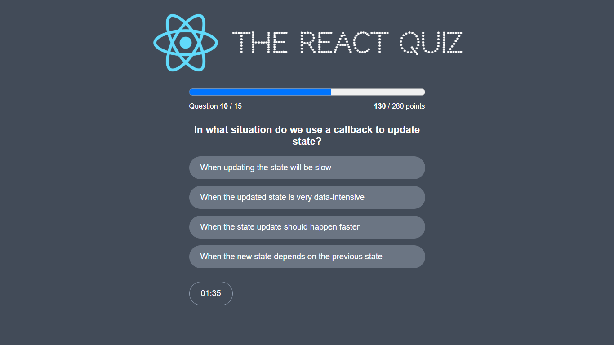

# React Quiz App



## 📋 Overview

The **React Quiz App** is a web application, designed to test and improve your knowledge of React fundamentals. The app presents multiple-choice questions covering topics like components, hooks, props, state, and more. It provides instant feedback and tracks your score to help reinforce key React concepts.

## 🔑 Key Features

- ❓ **Interactive Quiz**: Interactive multiple-choice questions.
- 🧠 **Score Tracking**: Tracks user progress and final score.
- 🔁 **Retry Quiz**: Option to retake the quiz.
- 🗄️ **JSON Server**: Simulate a backend server for storing quiz questions.

## Demo

View the live demo of the app: [React Quiz App](https://react-quiz-hazem.netlify.app)

**Note**: The App is using a fake REST API to simulate backend data. so the demo may not work as expected.

## Technologies Used

- **React**: JavaScript library for building user interfaces.
- **CSS**: Styling the application.
- **JSON Server**: Fake REST API for simulating backend data.

## Getting Started

### Prerequisites

- Node.js and npm installed on your local machine.

### Installation

1. Clone the repository:
   ```bash
   git clone https://github.com/hazemhesham-1/react-quiz.git
   ```
2. Navigate to the project directory:
   ```bash
   cd react-quiz
   ```
3. Install dependencies:
   ```bash
   npm install
   ```

### Running the App

1. Start JSON Server:
   ```bash
   npm run server
   ```
2. In another terminal, start the development server:
   ```bash
   npm start
   ```
3. Open [http://localhost:3000](http://localhost:3000) in your browser to view the app.

## Usage

1. Open the app in your browser.
2. Click the "Start Quiz" button to begin the quiz.
3. Answer the MCQ questions by clicking on the correct answer.
4. Click the "Next" button to move to the next question.
5. After answering all questions, see your final score.

## Learn More

To learn more about React, take a look at the following resources:

- [React Documentation](https://reactjs.org/docs/getting-started.html)
- [React Hooks](https://reactjs.org/docs/hooks-intro.html)

## Acknowledgements

- **Jonas Schmedtmann** - For the inspiration and guidance in building this project.
- **React** - For the powerful and flexible frontend library.
- **CSS** - For the styling and design of the application.
- **JSON Server** - For the fake REST API for simulating backend data.
- **Node.js** - For the JavaScript runtime environment.
- **npm** - For the Node Package Manager.
- **Git** - For the distributed version control system.
- **GitHub** - For the hosting and version control platform.
- **VS Code** - For the powerful and customizable code editor.
- **Chrome** - For the fast and modern web browser.
